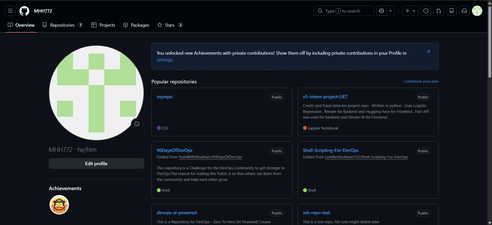
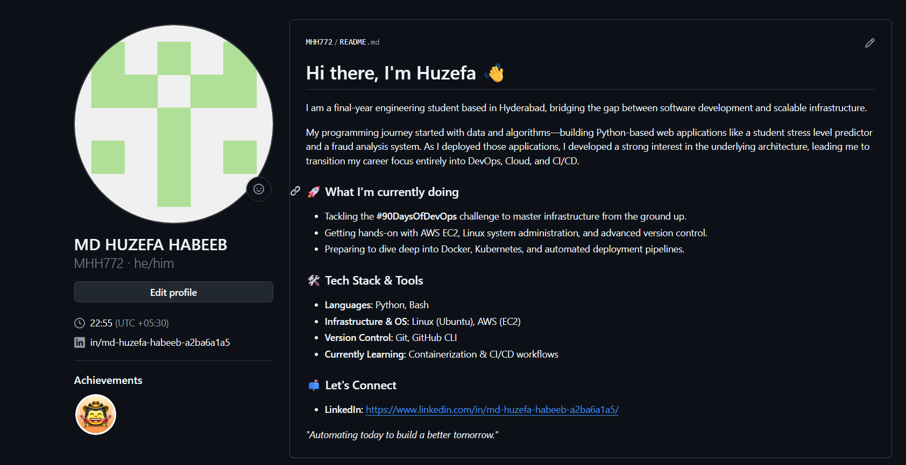

# Day 27 - GitHub Profile Makeover

## 1. Profile Audit
* **Profile Picture:** Changed from the default GitHub identicon to a professional headshot.
* **Bio:** Added a clear, concise bio stating my current education (LIET) and my focus on DevOps.
* **Pinned Repos:** Removed random tests and forks. Pinned my active DevOps challenges and my best Python projects (fraud detection) to show a well-rounded programming background.
* **Clean Up:** Deleted `ssh-repo-test` to remove unprofessional commit messages/descriptions from public view. 

## 2. Profile README
Created `MHH772/MHH772` to host a profile README. 
* Introduced myself and my journey from Python-based web applications to infrastructure.
* Listed my current focus (`#90DaysOfDevOps`) and my current tech stack (AWS, Linux, Git, Bash).
* Provided contact information for recruiters.

## 3. Before & After
#### Before :- 

#### After :- 
